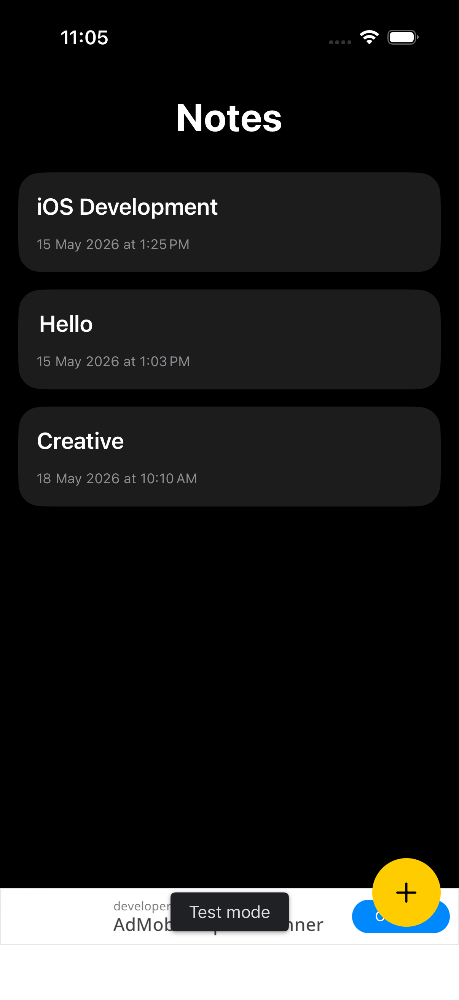
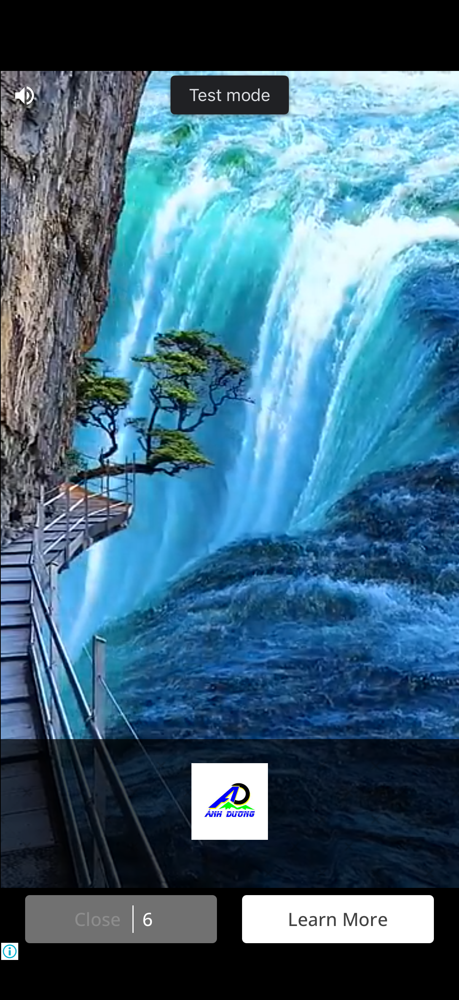
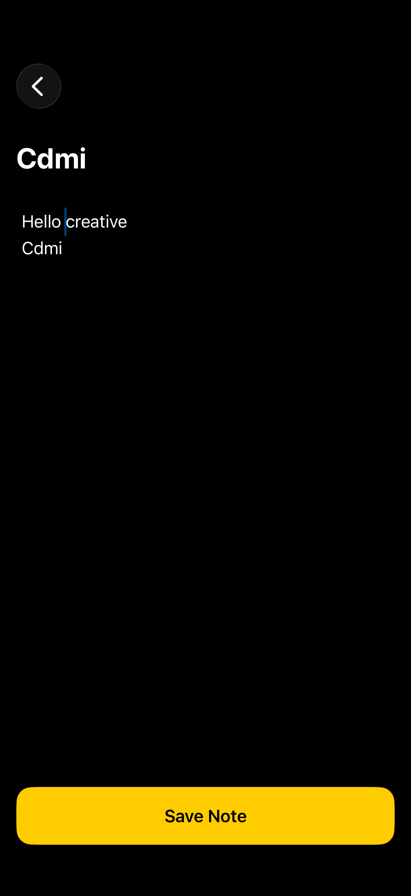
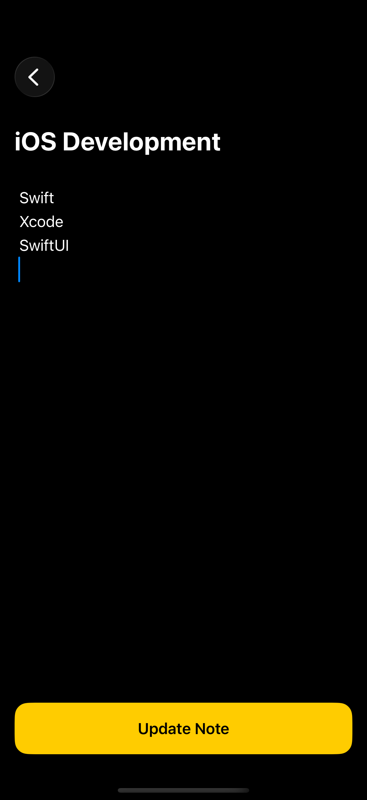
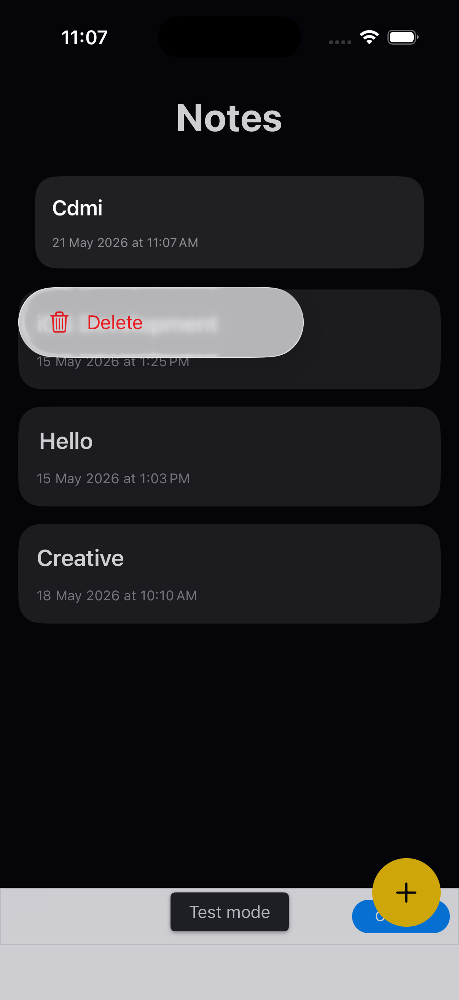

# NotesApp - iOS Notes Application

A modern Notes application built using **SwiftUI**, **Firebase Firestore**, and **Google AdMob**.

---

## Features

- Create Notes
- Save Notes using Firebase Firestore
- Real-time Data Storage
- Modern SwiftUI User Interface
- Banner Ads Integration
- Interstitial Ads Integration
- Clean Architecture
- Responsive UI
- Firebase Integration

---

## Tech Stack

- SwiftUI
- Firebase Firestore
- Google AdMob
- MVVM Architecture
- Xcode
- Swift

---
## Screenshots

<p align="center">
  
  
  
</p>

<p align="center">
  
  
</p>
---

## Firebase Features

- Firestore Database Integration
- Real-time Data Storage
- Cloud-based Notes Management

---

## AdMob Features

- Banner Ads
- Interstitial Ads

---

## Future Updates

- Edit Notes
- Delete Notes
- User Authentication
- Dark Mode Improvements
- Categories / Tags
- Cloud Sync Improvements

---

## Installation

1. Clone the repository

```bash
git clone https://github.com/khenisoham/NotesAPp.git
```

2. Open project in Xcode

3. Add your Firebase configuration file

```text
GoogleService-Info.plist
```

4. Run the project

---

## Author

Developed by Soham Kheni

---

## GitHub Repository

https://github.com/khenisoham/NotesAPp
